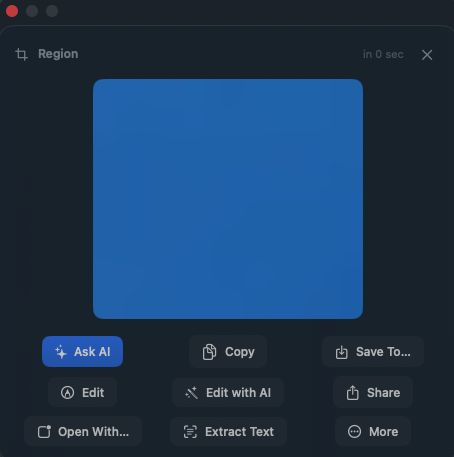
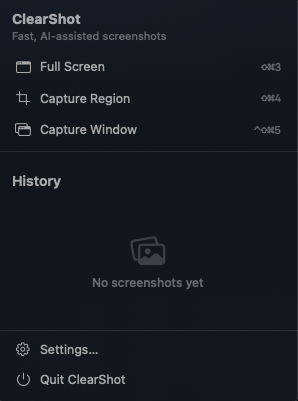
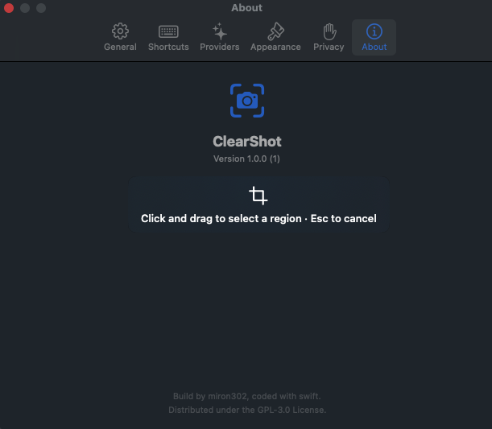

# ClearShot

A fast, native macOS screenshot utility with a polished result UI and optional AI-powered analysis and editing via Google Gemini.

## Why ClearShot

macOS's built-in screenshot tool is fine for a quick grab, but it doesn't let you *do* anything with what you just captured. ClearShot keeps the screenshot on screen after capture and gives you a real set of actions — copy, save, annotate, OCR, share, or hand it to an AI model to explain, summarize, or edit — all without leaving the keyboard.

## Features

- **Three capture modes** — full screen, click-and-drag region, or pick a specific window — each with its own configurable global shortcut.
- **A result UI that doesn't get in your way.** Screenshots open in a compact preview panel with actions instead of being silently copied and forgotten.
- **Extensible AI provider system.** Ships with Google Gemini; adding another provider means implementing one Swift protocol.
- **Ask AI** — explain, summarize, extract text, or answer a custom question about a screenshot.
- **Edit with AI** — describe a change in plain English and get back an edited image.
- **On-device OCR** — text extraction via Apple's Vision framework, no network request required.
- **Screenshot history** — a lightweight, configurable-retention local history with quick actions.
- **Secure by default** — API keys live only in the macOS Keychain, never in plist files or UserDefaults.
- **Native and fast** — built entirely on SwiftUI + AppKit, no Electron, no bloat.
- **Careful animations** — spring-based entrance/exit transitions throughout, with a global toggle to turn them off.
- Full dark mode, Retina, and keyboard-navigation support.

## Screenshots

| Screenshot | HUD | Menu Bar | About |
| ---------- | --- | -------- | ----- |
|  |  |  |  |

## Requirements

- macOS 13.0 (Ventura) or later
- Xcode 15 or later
- [XcodeGen](https://github.com/yonaskolb/XcodeGen) (used to generate the `.xcodeproj` — see below)
- A free [Google AI Studio](https://aistudio.google.com/apikey) API key if you want to use AI features (optional — the app is fully usable without one)

#

## Keyboard shortcuts

All shortcuts are re-bindable in **Settings → Shortcuts**.

| Action | Default shortcut |
| ---------------------- | ---------------- |
| Open capture chooser | `⌘⇧Space` |
| Full-screen screenshot | `⌘⇧3` |
| Region screenshot | `⌘⇧4` |
| Window screenshot | `⌘⇧⌃5` |

## Privacy

- Screenshots and history are stored **only** in your local `~/Library/Application Support/ClearShot` folder.
- API keys are stored **only** in the macOS Keychain.
- On-device OCR uses Apple's Vision framework — nothing is uploaded for text extraction.
- A screenshot is sent to an AI provider **only** when you explicitly choose "Ask AI" or "Edit with AI."
- ClearShot collects no analytics or telemetry of any kind.

Full details are always visible in **Settings → Privacy**.

## License

Released under the [GNU General Public License v3.0](LICENSE).
